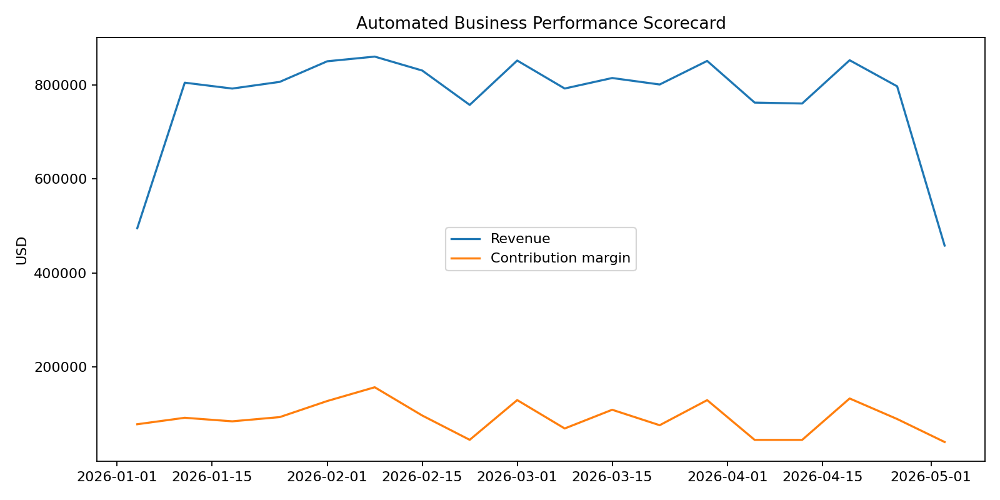

# Business Performance Monitoring & Alert System AI Extension

An end-to-end analytics and automation project designed to automate business performance monitoring, KPI scorekeeping, anomaly detection and manager-facing alerts.

The system transforms raw operational data into actionable performance insights using Python and SQL, reducing the need for repetitive manual reporting and allowing managers to focus on exceptions that require attention.

## Business Problem

Operational teams often spend significant time manually extracting data, calculating KPIs, comparing performance across teams and identifying underperformance.

This project demonstrates how this workflow can be automated from raw data ingestion through performance monitoring and alert generation.

## Solution

The system automatically:

- Processes daily business performance data
- Calculates operational and financial KPIs
- Monitors performance across markets and teams
- Establishes historical performance baselines
- Detects meaningful performance deviations
- Generates manager-facing alerts
- Produces an automated performance scorecard
- Creates a concise management summary for investigation

## Architecture

Business Data  
↓  
Python / SQL Processing  
↓  
Data Validation & Transformation  
↓  
KPI Calculation  
↓  
Historical Baseline Comparison  
↓  
Anomaly Detection  
↓  
Automated Alerts  
↓  
Performance Scorecard  
↓  
Manager Summary

## KPIs Monitored

The system evaluates business performance using metrics such as:

- Conversion Rate
- Customer Acquisition Cost (CAC)
- Contribution Margin
- Revenue and operational performance indicators
- Team and market-level performance
- Variance against historical baselines

## Automation Workflow

`generate_data.py`

Generates the synthetic business dataset used to demonstrate the system.

`pipeline.py`

Processes the data, calculates performance metrics and identifies deviations.

`kpi_model.sql`

Demonstrates SQL-based KPI aggregation and business metric logic.

`dashboard.py`

Generates the visual performance scorecard.

`run_all.py`

Runs the complete workflow from data generation through analytics and reporting.

`test_pipeline.py`

Validates key calculations and pipeline behavior.

## Example Output



The automated scorecard provides a visual overview of business performance and helps surface areas requiring management attention.

## Demonstration Results

The portfolio dataset contains **1,440 synthetic business observations** across multiple markets and teams.

The pipeline automatically processes these observations, calculates KPIs and generates performance exceptions and alerts based on defined business rules and historical performance.

See `alerts.csv` for the generated alert output and `manager_summary.txt` for the management-facing summary.

> **Note:** This project intentionally uses synthetic data. Results demonstrate the functionality of the automation system and should not be interpreted as production business results.

## AI-Ready Design

The system separates deterministic business logic from the AI layer.

KPI calculations, thresholds and alert conditions remain transparent and auditable. Validated exceptions can then be passed to an AI layer to generate concise manager-facing summaries, explain detected issues and recommend investigation steps.

This approach keeps core business metrics reliable while using AI where it provides the most value: interpretation, prioritization and communication.

## Tech Stack

- Python
- pandas
- NumPy
- SQL
- Matplotlib
- Automated data validation
- KPI analytics
- Anomaly detection
- Business intelligence
- Workflow automation

## Project Structure

```text
ai-business-performance-monitoring/
│
├── generate_data.py
├── pipeline.py
├── dashboard.py
├── run_all.py
├── kpi_model.sql
├── test_pipeline.py
├── business_daily.csv
├── alerts.csv
├── manager_summary.txt
├── performance_scorecard.png
├── requirements.txt
├── LOOM_SCRIPT.md
└── APPLICATION_TEXT.md

Run the Project
Install the required Python packages:

pip install -r requirements.txt

Run the complete workflow:
python run_all.py

Run the tests:
pytest test_pipeline.py

Why I Built This
I built this project to demonstrate how analytics, automation and AI-ready workflows can solve repetitive operational reporting problems.
The objective is not simply to create a dashboard, but to build a workflow that automatically turns raw business data into measurable KPIs, identifies exceptions and surfaces the information that requires human attention.
Author: Celya Taklit
Focus: Data Analytics | Business Intelligence | AI & Workflow Automation
